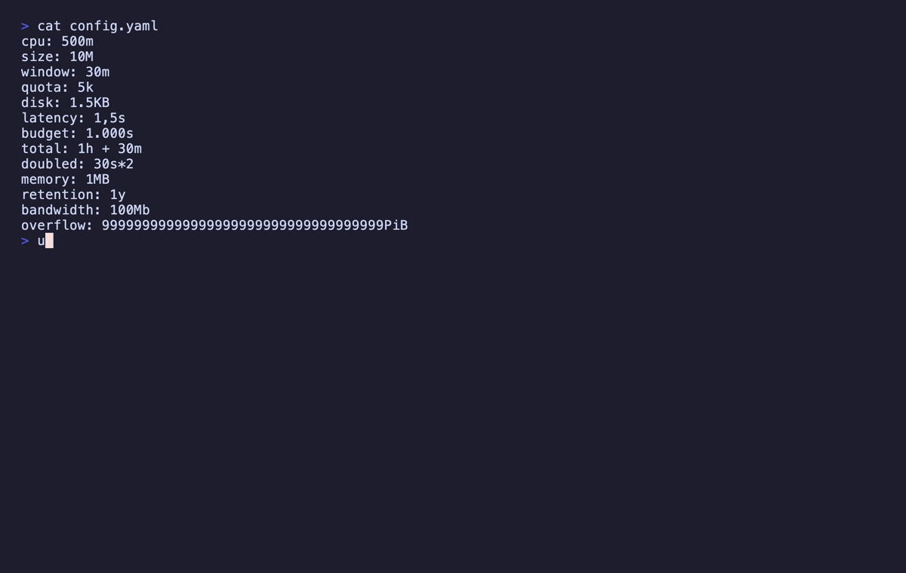

<p align="center">
  
</p>
<h1 align="center">Units-LE: One Quantity, One Unit</h1>
<p align="center">
  <b>Find every quantity in a document — durations, sizes, percentages, frequencies — with its value in one base unit, and refuse the ambiguous ones by name</b><br/>
  <i>YAML · TOML · JSON · INI · dotenv · CSV · and anything else, scanned as text</i>
</p>

<p align="center">
  <a href="https://marketplace.visualstudio.com/items?itemName=nolindnaidoo.units-le">
    
  </a>
  <a href="https://open-vsx.org/extension/OffensiveEdge/units-le">
    
  </a>
  <a href="https://www.npmjs.com/package/units-le-mcp">
    
  </a>
  <a href="https://crates.io/crates/units-le">
    
  </a>
  <a href="https://letools.dev/tools/units-le">
    
  </a>
</p>

---

> **Useful?** A star or rating is how other developers find it —
> [★ GitHub](https://github.com/nolindnaidoo/units-le) ·
> [★ Open VSX](https://open-vsx.org/extension/OffensiveEdge/units-le/reviews) ·
> [★ Marketplace](https://marketplace.visualstudio.com/items?itemName=nolindnaidoo.units-le&ssr=false#review-details)

## What it does

`timeout: 30s` in one service and `timeout: 30000` in another are the same number of milliseconds, and nothing about the text says so. `memory: 1GB` and `memory: 1GiB` differ by 7% and look identical at a glance.

Press `Ctrl+Alt+Q` (`Cmd+Alt+Q` on Mac) and every quantity in the active document — a number welded to a unit — opens in a report beside the editor: as the document wrote it, in one base unit so two of them can be compared, with its line, column and key path. A quantity it cannot read unambiguously keeps its row and gets a reason instead of a guess. Works in VS Code and in VS Code–based editors like Cursor and VSCodium (installable from Open VSX).

- **Before a migration** — every timeout and memory limit in a values file, in milliseconds and bytes
- **Reviewing a config change** — the `500m` that means minutes to one reader and millicores to another
- **Against a runbook or a retention policy** — the limit the document states, checked against the one the config sets

**It never rewrites a document, and never guesses.**

## Install

| Where | What you get | Install |
|---|---|---|
| **VS Code** | The report, in your editor, on a keystroke | [Marketplace](https://marketplace.visualstudio.com/items?itemName=nolindnaidoo.units-le) |
| **Cursor, VSCodium, Windsurf** | The same extension | [Open VSX](https://open-vsx.org/extension/OffensiveEdge/units-le) |
| **A terminal or a CI step** | A whole tree, with exit codes | `cargo install units-le` · [crates.io](https://crates.io/crates/units-le) |
| **Any MCP agent, via Node** | `extract_units` over stdio | `npx units-le-mcp` · [npm](https://www.npmjs.com/package/units-le-mcp) |
| **Zed** | The MCP server as a context server | [add it by hand](https://zed.dev/docs/ai/mcp) *(no listing yet)* |

## A refusal is a finding

This is the whole product. Any tool can multiply `30s` by a thousand;
what makes this one usable in a review is that it will not pretend.

| It sees | Reason | What comes back |
|---|---|---|
| `500m`, `10M`, `5k`, `1y`, `100Mb` | `ambiguous_unit` | no base value — `m` is minutes, milliseconds or Kubernetes millicores; `M` is mega- or minutes; `k`/`K`/`G`/`T`/`P` are prefixes with no unit after them; a calendar year has no fixed length; a lowercase `b` is bits by the standard and bytes in most software that writes it |
| `1.5KB`, `1.5KiB` | `fractional_bytes` | no base value — a byte count has no fractional part. `1.5KiB` is exactly 1536 bytes and is **still** refused: the refusal is about the category, not the arithmetic |
| `1,5s`, `1.000s`, `1.2.3s` | `locale_separator` | no base value — one and a half, or fifteen hundred? This tool does not infer a locale. Narrowed so `0.825s` and `2.5s` read normally |
| `1h + 30m`, `30s*2` | `compound_arithmetic` | no base value — an expression, not a quantity, reported as **one** finding rather than two |
| `1MB`, `256KB` | `si_iec_hazard` | **the base value, plus the reason** — see below |
| `99999…PiB` | `out_of_range` | no base value — it does not fit in 128 bits, and is refused rather than wrapped |

Every one of them keeps its row, its source text, its position and a
sentence a person can act on. A refusal is never a dropped row and
never a guess.

### `si_iec_hazard` annotates; it does not withhold

It is the one reason that still answers. `MB` is 10^6 by the standard,
so `1MB` comes back as **1000000 bytes** *and* carries
`reason: "si_iec_hazard"` — because a great deal of software writes
`MB` and means 2^20. Reporting nothing would be less useful than
reporting the standard answer with the flag attached, and picking 2^20
would be the guess this tool exists not to make.

So it is **not counted as refused**. A row with `si_iec_hazard` is the
only row that carries both a `base` and a `reason`; every other reason
means the base is `null`.

**A bare number with no unit is not a finding at all.** `timeout: 30`
yields nothing here — that is
[numbers-le](https://github.com/nolindnaidoo/numbers-le)'s question, and
the boundary is what keeps the two tools distinct.

## Four dimensions

| Dimension | Base unit | Units read |
|---|---|---|
| `duration` | milliseconds | `ns` `us` `µs` `μs` `ms` `s` `sec` `secs` `min` `mins` `h` `hr` `hrs` `d` `day` `days` `w` · compounds `1h30m` · ISO-8601 `PT1H30M` `P1DT2H` `P2W` `PT0.5S` |
| `bytes` | bytes | `B` · SI `kB` `KB` `MB` `GB` `TB` `PB` · IEC `KiB` `MiB` `GiB` `TiB` `PiB` · Kubernetes `Ki` `Mi` `Gi` `Ti` `Pi` |
| `percent` | ratio | `%` — `15%` is `0.15` |
| `frequency` | hertz | `Hz` `kHz` `KHz` `MHz` `GHz` `THz` |

**Case is part of the symbol.** `MB` is a megabyte and `Mb` is a
megabit; folding them would silently multiply by eight, so `Mb` is
refused rather than treated as a synonym.

**`1h30m` is a grammar and `1h + 30m` is arithmetic.** The first is one
quantity written in two parts. Inside a compound the parts disambiguate
each other — `m` alone is refused, and `m` between `h` and `s` can only
be minutes, because a compound is written largest-first. That ordering
is required rather than assumed, so `30s1h` is not a quantity at all.

**Physical units are a non-goal, not a gap.** Length, mass, temperature
belong to a different question, and reading them would mean unit algebra
(`m/s²`), which is what `uom` is for. See
[`crate/SPEC.md`](crate/SPEC.md).

## Formats

JSON, YAML, CSV, TOML, INI and dotenv are parsed. **Everything else is
scanned as text** — a Kubernetes manifest, a Terraform file, a Markdown
table of limits, a log — so the files where quantities actually live
yield them rather than nothing.

Unlike numbers-le's text scan, this one has a shape to look for, so
`v1.2.3` yields nothing rather than two numbers. Every format with a
shape carries a key path — `cache.ttl`, `limits[0]`, `server.timeout`,
`TIMEOUT` — and every finding carries a 1-based line and column, the
column in UTF-16 units, which is the number your editor shows.

**Its false-positive class is measured rather than imagined.** A run
inside an opaque blob still reads as a quantity: `001d` in a UUID is one
day, and a base64 hash ending `/2w==` is two weeks. The boundary
characters that let those through are the same ones that let `-30s` and
`ttl=30s` through. Over `crate/fixtures/documents/opaque.txt` — 280
lines of lockfile hashes, container digests, git object names, UUIDs and
signing material, none of which is a quantity — the scan reports **5
false findings, 1.8%**, and a test prints that number on every run.
Each one carries its line and column, which is what makes it a row you
discard rather than a number you trust.

## It has no opinions

No "this timeout is too low". No defaults database. No conversion flag,
no rewriting, no arithmetic. It reports what a document says and what
that means in one base unit; which limits are right is the reviewer's
call.

## Use it from an AI agent

The same engine runs as an [MCP](https://modelcontextprotocol.io) server, so an agent can read quantities directly instead of converting units by hand.

| Editor | How |
|---|---|
| **VS Code** 1.101+ | Nothing to install — the extension registers `extract_units` with agent mode |
| **Zed** | No listing yet — [add the MCP server by hand](https://zed.dev/docs/ai/mcp) |
| **Claude Code** | `claude mcp add units-le -- npx -y units-le-mcp` |
| **Cursor, Windsurf, anything else** | point it at `npx units-le-mcp` |

```
extract_units(content, format?, filename?, dimension?, maxResults?)
```

It returns the report the editor renders, as data — quantities capped at 500 by default with `meta.truncated`. It reads no files and makes no network requests. Published as [`units-le-mcp`](https://www.npmjs.com/package/units-le-mcp) on npm and as `io.github.nolindnaidoo/units-le` in the [MCP registry](https://registry.modelcontextprotocol.io). It answers exactly as the Rust CLI's server does: one corpus runs against both, and a differential test feeds both thousands of generated documents in every format — broken ones included, so each parser's error text is compared too.

<details>
<summary><b>Configuring it by hand</b> — any host with an MCP config file</summary>

```json
{
  "mcpServers": {
    "units-le": {
      "command": "npx",
      "args": ["-y", "units-le-mcp"]
    }
  }
}
```

Or install it once with `npm install -g units-le-mcp` and point at `units-le-mcp`. It needs no environment variables, no API key and no configuration of its own. To check it:

```bash
echo '{"jsonrpc":"2.0","id":1,"method":"tools/list"}' | npx -y units-le-mcp
```

</details>

## The CLI

The same extraction runs over a tree from a terminal or a CI step: a Rust CLI in [`crate/`](crate/README.md), sharing one corpus with the extension — [`crate/fixtures/`](crate/fixtures/) — so the two can never read a quantity differently.

<p align="center">
  
</p>

```bash
units-le .                                 # every quantity in the tree, one JSON report per file
units-le --dimension duration config/      # only the timeouts
units-le --strict config/                  # exit 2 if anything was refused
cat values.yaml | units-le --stdin --format yaml
units-le mcp                               # extract_units and units_le_scan over MCP on stdio
```

**Exit codes follow grep** — 0 quantities found, 1 none found, 2 the question was malformed. A refusal does not change the exit code; `--strict` makes it one.

## Commands

| Command | Description |
|---|---|
| `Units-LE: Extract Quantities` (`Ctrl+Alt+Q` / `Cmd+Alt+Q`) | Every quantity in the active document, as the editor holds it |
| `Units-LE: Open Settings` | Open Units-LE settings |
| `Units-LE: Help & Troubleshooting` | Built-in documentation |

## Settings

| Setting | Default | Description |
|---|---|---|
| `units-le.dimensions` | `[]` | Report only these dimensions; empty reports all four. A refusal that names no dimension is always reported |
| `units-le.openResultsSideBySide` | `true` | Open the report beside the current editor |
| `units-le.copyToClipboardEnabled` | `false` | Also copy the report to the clipboard |
| `units-le.notificationsLevel` | `silent` | `all` = every notification, `important` = warnings + errors, `silent` = errors only |
| `units-le.safety.enabled` | `true` | Warn before reading a large file |
| `units-le.safety.fileSizeWarnBytes` | `1000000` | Size above which the warning appears |
| `units-le.statusBar.enabled` | `true` | Show the status bar item |
| `units-le.telemetryEnabled` | `false` | Local-only event log (see Privacy) |

## Languages

Twelve languages besides English:

German · Spanish · French · Indonesian · Italian · Japanese · Korean ·
Portuguese (Brazil) · Russian · Ukrainian · Vietnamese · Chinese (Simplified)

Both halves are covered — the manifest (command titles, setting names and descriptions) and everything shown while the extension runs (notifications, the status bar and the report's headings). A refusal's sentence and a parser's error are the engine's English, identical to the CLI's.

## Privacy & security

- **No network access.** The extension never sends data anywhere. The `telemetryEnabled` setting only writes events to a local Output Channel you can inspect (`Units-LE`).
- **It reads the active document and nothing else**, and never writes to it.
- **The MCP server holds the same line.** It takes content as an argument and returns data: no filesystem access, no network calls, no telemetry.
- Error notifications redact home directories and credential-shaped fragments.

## Documentation

| What | Where |
|---|---|
| What the tool is allowed to say — the grammar, the refusals, the output contract, non-goals | [`crate/SPEC.md`](crate/SPEC.md) |
| How the extension is built and held together — architecture, invariants, toolchain, release | [AGENTS.md](AGENTS.md) |
| How the CLI is built and held together | [`crate/AGENTS.md`](crate/AGENTS.md) |
| What changed | [CHANGELOG.md](CHANGELOG.md) · [`crate/CHANGELOG.md`](crate/CHANGELOG.md) |
| The tool's page, and the other fifteen | [letools.dev/tools/units-le](https://letools.dev/tools/units-le) |

## Performance

<!-- performance:start -->
| Input | Size | Found | Time | Rate | Scan speed |
| --- | --- | --- | --- | --- | --- |
| YAML config | 0.88 MB | 50,000 | 107.63 ms | 464,557/sec | 8.2 MB/s |
| TOML config | 0.73 MB | 30,000 | 49.08 ms | 611,287/sec | 14.9 MB/s |
| Log, scanned as text | 3.25 MB | 120,000 | 327.9 ms | 365,967/sec | 9.9 MB/s |

Median of 7 runs after warmup, on Apple M5 Pro, 24 GB RAM, Node 24.3.0. Inputs are generated
by `scripts/benchmark.ts` rather than checked in, so the sizes above are
exactly what was measured. Reproduce with `bun run benchmark`.

These are machine-specific and are not asserted in CI — a benchmark that gates
a build only tells you how busy the runner was.
<!-- performance:end -->

## Testing

<!-- coverage:start -->
| Metric | Coverage |
| --- | --- |
| Statements | 86.16% |
| Branches | 78.39% |
| Functions | 95.23% |
| Lines | 88.06% |

531 test cases across 11 files, plus an integration suite that runs
in a real VS Code extension host and an end-to-end test that installs the
built `.vsix` into a clean profile.

Generated from a real run — `coverage/coverage-summary.json` and
`coverage/test-results.json` — by `scripts/coverage-readme.js`; CI fails if
this section drifts. Reproduce with `bun run test:coverage`, and the case
count is the one vitest prints.
<!-- coverage:end -->

## More from the LE family

Sixteen single-purpose tools for the work in front of every model. Each ships
a Rust CLI and an MCP server. One page: **[letools.dev](https://letools.dev)**

**Get it out**

- **[String-LE](https://letools.dev/tools/string-le)** — Extract every string in a codebase, with its position, so a person can read them
- **[Numbers-LE](https://letools.dev/tools/numbers-le)** — Extract every hardcoded number in a codebase, so a person can check them
- **[Units-LE](https://letools.dev/tools/units-le)** — Extract every quantity with its unit, normalized, and refuse the ambiguous ones by name
- **[Dates-LE](https://letools.dev/tools/dates-le)** — Extract every date and timestamp, and the exact instant each one resolves to
- **[IDs-LE](https://letools.dev/tools/ids-le)** — Extract every UUID, ULID, NanoID, ObjectId and Snowflake, and decode the time inside
- **[IPs-LE](https://letools.dev/tools/ips-le)** — Extract every IP address, CIDR block and MAC, normalized and classified by scope
- **[URLs-LE](https://letools.dev/tools/urls-le)** — Extract every URL in a codebase, with its protocol and exact position
- **[Paths-LE](https://letools.dev/tools/paths-le)** — Extract every file path in a codebase, and say whether it still points at anything
- **[Colors-LE](https://letools.dev/tools/colors-le)** — Extract every color in a codebase, and say which ones are not in your palette

**Check it**

- **[Regex-LE](https://letools.dev/tools/regex-le)** — Find every regex in a codebase, and report which can be driven into catastrophic backtracking
- **[Versions-LE](https://letools.dev/tools/versions-le)** — Find where one dependency is constrained differently across a repository's manifests
- **[i18n-LE](https://letools.dev/tools/i18n-le)** — Identify the i18n library a project uses, then audit its catalogs by that library's rules
- **[Scrape-LE](https://letools.dev/tools/scrape-le)** — Check whether a page is scrapeable before the scraper is written, and say when it cannot tell

**Guard it**

- **[Secrets-LE](https://letools.dev/tools/secrets-le)** — Find hardcoded credentials in a codebase, and never print one into the report
- **[EnvSync-LE](https://letools.dev/tools/envsync-le)** — Compare the dotenv files in a tree, and say which keys are missing from which
- **[Unicode-LE](https://letools.dev/tools/unicode-le)** — Find the Unicode that hides meaning — bidi controls, invisibles, homoglyphs, mixed scripts

Each stands on its own: no shared crate, no published core. Where two of them
agree, it is because the same answer was right twice.

**Contact** — [nolindnaidoo.com](https://nolindnaidoo.com) · [GitHub](https://github.com/nolindnaidoo) · [LinkedIn](https://www.linkedin.com/in/nolindnaidoo/)

## Also by nolindnaidoo

**Rust** — pixelcoords and pixelactions are one loop: pixelcoords answers
*where*, pixelactions *acts* there. Their own tools, their own voice — not
part of the LE family.

- **[pixelcoords](https://github.com/nolindnaidoo/pixelcoords)** — Freeze your screen, mark regions, get pixel-exact coordinates and crops
  [pixelcoords.dev](https://pixelcoords.dev) · [crates.io](https://crates.io/crates/pixelcoords) · [docs.rs](https://docs.rs/pixelcoords)
- **[pixelactions](https://github.com/nolindnaidoo/pixelactions)** — Consume human-verified coordinates, perform the interaction, confirm it landed
  [pixelactions.dev](https://pixelactions.dev) · [crates.io](https://crates.io/crates/pixelactions) · [docs.rs](https://docs.rs/pixelactions)

## License

MIT © [nolindnaidoo](https://github.com/nolindnaidoo)
